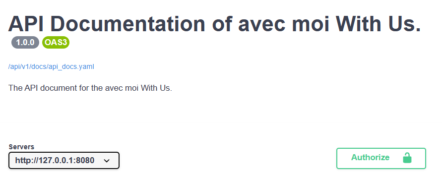
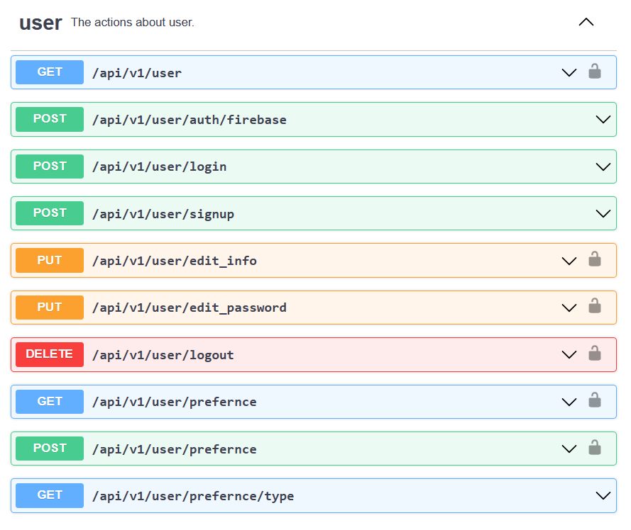
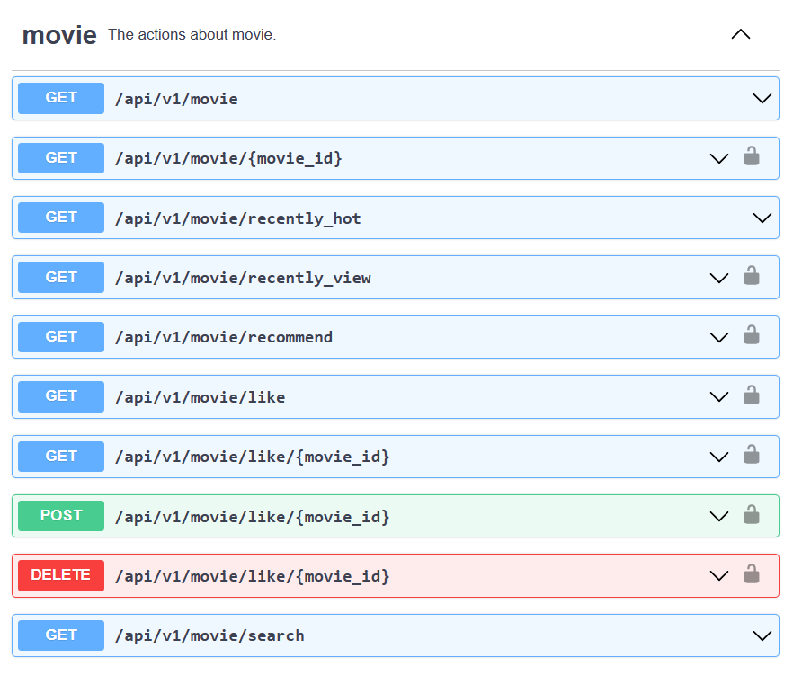
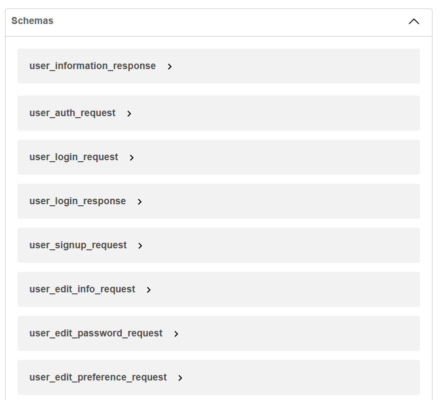

# Avec Moi With Us API
The server for the application, Avec Moi With Us.

## Primary Feature
* JWT authentication
* Connect to firebase
* Layered Structure Design
* OPEN API (SWAGGER)
* ...

## OPEN API (SWAGGER) Document

### API Document Title


### API Document About User


### API Document About Movie


### API Document Models


## Design Pattern
### [There Layered Architecture](https://en.wikipedia.org/wiki/Multitier_architecture#Three-tier_architecture)
- #### Presentation Layer
- #### Business Logic Layer
- #### Data Access Layer

```markdown
Project Architecture

├── api
│   ├── handler
│   ├── middleware
│   ├── request
│   ├── response
│   ├── routes
│
├── internal
│   ├── repository
│   ├── service
│
├── templates
│
├── go.mod
├── go.sum
│
├── main.go
```